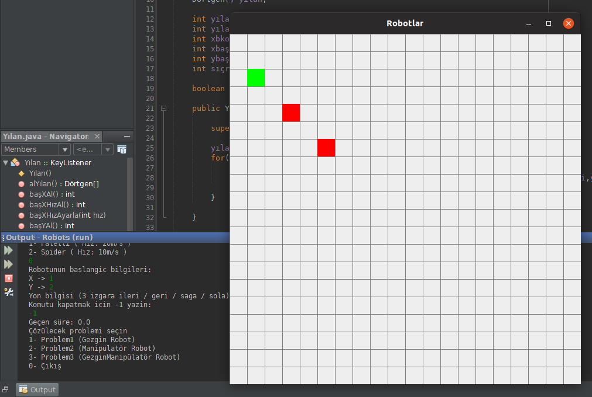
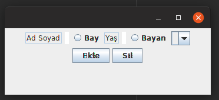
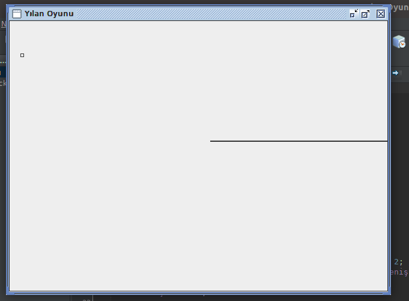

# JavaCalismalarim
Java dili üzerine yapmış olduğum çalışma amaçlı geçici projeler.

## Java Bookcase
Konsol tabanlı kütüphane uygulaması

* SQL kullanılan için [buraya](NetBeans-Projects/Bookcase-SQL/) 
* Dosya işlemleri kullanılan için [buraya](NetBeans-Projects/Bookcase-FileOp/) 

# Java Robots

Gezgin, Manipulator ve GezginManipulator robotları ele alan. 

- Polymorphisim
- Inheritance
- Encapsulation
- Abstraction

gibi yapılar kullanılmıştır.

> Detaylar için [buraya](NetBeans-Projects/Robots/) tıklayabilirsin.

# Java Augmented RB-Tree & RB-Tree 

Augmented-RB-Tree çalışması.

> Detaylar için [buraya](Stand-Alone-Projects/RBTreeAugmentedTree/) tıklayabilirsin.

# Java Binary Tree

Java üzerinden binary tree örneği.

> Detaylar için [buraya](Stand-Alone-Projects/JavaBinaryTree/) tıklayabilirsin.

# Android Oreo Ders Çalışma

Java üzerinden android oreo kodlama kursundan aldığım ders notlarının uygulama üzerinden birleştirilmiş halidir.

> Detaylar için [buraya](Android-Projects/AndroidOreoDers/) tıklayabilirsin.

# Cafe Otomasyonu

Yarım kalmış bir kafe otomasyon sistemi. İşlevsiz durumda olsa da kalıp kodları mevcut.

> Detaylar için [buraya](NetBeans-Projects/CafeOtomasyonu/) tıklayabilirsin.

# Java Database Çalışma

JDBC üzerine bir çalışma amaçlı yazılmış kod.

> Detaylar için [buraya](NetBeans-Projects/JavaDbCalisma/) tıklayabilirsin.

# NYP (Nesneye Yönelik Programlama) Dersi Örnek Soru Çözümü

NYP dersinin sınav sorusunun çözümü

> Detaylar için [buraya](NetBeans-Projects/NYPfinal/) tıklayabilirsin.

# Ogrenci İşleri Otomasyonu

Okul tarafından ödev olarak verilen konsol tabanlı öğrenci işleri otomasyonu uygulaması. (win10)

> Detaylar için [buraya](NetBeans-Projects/OgrenciOtomasyonu/) tıklayabilirsin.

# Yılan Oyunu Kalıbı

Java üzerinden yazılmış olan değişik bir yılan oyundur. Kuyruğu falan kopuyor :D

> Detaylar için [buraya](NetBeans-Projects/YilanOyunuKalibi/) tıklayabilirsin.

